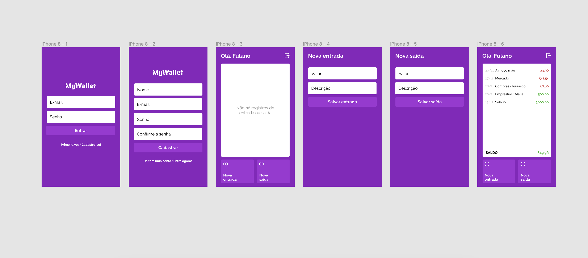

<h1 align="center">My Wallet - Front </h1>

✅ Requisitos

- Geral
    - [ ]  Será necessário fazer o *deploy* do projeto (front-end, back-end e banco de dados na ☁️)
        - Tutoriais de como fazer os deploys
            
            [Tutorial: Deploy de projetos React na Vercel](https://www.notion.so/Tutorial-Deploy-de-projetos-React-na-Vercel-62fa866558034c73b31f89a0e4a3c697)
            
            [Tutorial: Deploy de aplicações back-end no Render (MongoDB)](https://www.notion.so/Tutorial-Deploy-de-aplica-es-back-end-no-Render-MongoDB-d062570799fa49fc82060865a7b73f8c)
            
    - [ ]  Separe o projeto em dois repositórios diferentes: um para o *front-end* e outro pro *back-end.*
    - [ ]  Versionamento usando Git é obrigatório. Crie repositórios públicos no seu perfil do GitHub**.** Faça *commits* a cada funcionalidade implementada.
    - [ ]  Seus projetos devem ter, obrigatoriamente, os arquivos `package.json` e `package-lock.json`, que devem estar na raiz do projeto. Eles devem conter todas as dependências do projeto.
    - [ ]  Tanto no front-end quanto no back-end, utilize o **dotenv** para administrar as variáveis de ambiente. Para mais detalhes, leia as instruções em **Para correção automática**.
    - Instruções específicas do front-end
        - [ ]  Implemente o *front-end* utilizando HTML, CSS, JS e **React** e as tecnologias que utilizamos até aqui, conforme o necessário para atender o *layout*.
        - [ ]  Rode o React sempre na porta `8000`
    - Instruções específicas do back-end
        - [ ]  Arquitete o *back-end* em *controllers*, *routers* e *middlewares.*
        - [ ]  A porta utilizada pelo seu servidor deve ser a **5000**.
        - [ ]  Não esqueça de criar o `.gitignore:` a `node_modules` e o `.env` não devem ser commitados.
        - [ ]  Adicione o código que inicia o servidor, com a função `listen`, no arquivo `src/app.js`.
        - [ ]  No back-end, adicione um *script* no `package.json` para iniciar o servidor rodando `npm start` como no exemplo abaixo:
            
            ```json
            // package.json
            {
              //...
              "scripts": {
                //...
                "start": "node ./src/app.js"
              }
            }
            ```
            
- Armazenamento e formato dos dados
    - [ ]  Arquitete o seu *back-end* em *controllers*, *routers* e *middlewares.*
    - [ ]  Neste projeto, você é quem determinará a maneira como os dados serão guardados no banco. Escolha os nomes dos campos de forma coerente e siga as validações indicadas ao longo do enunciado.
- Cadastro
    - [ ]  O usuário deve ser capaz de criar uma conta na tela de rota `/cadastro`.
    - [ ]  Através de uma requisição **POST**, realize o cadastro do usuário no banco de dados.
        - [ ]  Todos os campos são obrigatórios. Faça validações de acordo com a necessidade no front e no back que garantam que todos os dados estejam presentes.
        - [ ]  O e-mail deve ter um formato válido. Caso não possua, a requisição deve retornar o status code `422 (Unprocessable Entity)`e o front-end deve mostrar uma mensagem explicando o erro.
        - [ ]  A senha deve possuir no mínimo três caracteres. Caso não possua, a requisição deve retornar status `422 (Unprocessable Entity)`e o front-end deve mostrar uma mensagem explicando o erro.
        - [ ]  Caso já exista um usuário com este e-mail cadastrado, a requisição deve retornar status code `409 (Conflict)` e o front-end deve mostrar uma mensagem explicando o erro.
        - [ ]  Caso algum dos campos não esteja presente ou esteja em um formato inválido, a requisição deve retornar status code `422 (Unprocessable Entity)` e o front-end deve mostrar uma mensagem explicando.
        - [ ]  Em caso de sucesso, a requisição deve retornar status `201 (Created)`.
    - [ ]  Caso as senhas inseridas nos campos de *senha* e *confirme senha* não sejam iguais, a requisição não deve ser feita. Valide no front-end se esses valores são iguais e, somente então, envie sua requisição para a API (não é necessário enviar a senha duas vezes).
    - [ ]  Realize a criptografia da senha do usuário para guardá-la no banco de dados.
- Login
    - [ ]  O usuário deve ser capaz de entrar na aplicação na tela de rota `/login`.
    - [ ]  Através de uma requisição **POST**, realize o *login* do usuário.
        - [ ]  Todos os campos são obrigatórios. Faça validações de acordo com a necessidade no front e no back que garantam que todos os dados estejam presentes.
        - [ ]  O e-mail deve ter um formato válido. Caso não possua, a requisição deve retornar o status code `422 (Unprocessable Entity)` ****e o front-end deve mostrar uma mensagem explicando o erro.
        - [ ]  Caso o e-mail de *login* não esteja cadastrado, a requisição deve retornar status code `404 (Not Found)` e o front-end deve mostrar uma mensagem explicando o erro.
        - [ ]  Caso a senha enviada não seja correspondente com a que está cadastrada, a requisição deve retornar status code `401 (Unauthorized)` e o front-end deve mostrar uma mensagem explicando o erro.
    - [ ]  Em caso de sucesso no *login* (e-mail e senha corretos), a requisição deve retornar status code `200 (OK)` e um *token*. O usuário deve ser redirecionado para a rota `/home`.
    - [ ]  Para manter o usuário logado, utilize o `local storage`.
        - 🔥 Dica: no projeto TrackIt, deixamos alguns artigos sobre essa funcionalidade. Durante a correção gravada do projeto, ela foi implementada.
- Adicionar operações de entrada e saída
    - [ ]  O usuário deve ser capaz de adicionar transações do tipo `entrada` ou `saida` na aplicação, na tela de rota `/nova-transacao/:tipo`.
    - [ ]  Adicionar uma transação com endpoints do tipo **POST**.
        - [ ]  Essa rota deve receber o *token* de autorização do usuário. Caso não receba, deve enviar o status `401 (Unauthorized)`.
        - [ ]  O tipo de dado do valor deve ser flutuante (ex: 40.5) e positivo.
        - [ ]  Todos os campos são obrigatórios. Faça validações de acordo com a necessidade no front-end e no back-end que garantam que todos os dados estejam presentes.
        - [ ]  Caso algum dado seja enviado à API em formato inválido, a resposta à requisição deve possuir o status `422 (Unprocessable Entity)` e o front-end deve exibir uma mensagem explicativa ao usuário.
- Listagem de operações
    - [ ]  Na tela `/home`, o usuário deve ser capaz de ver todas as suas transações realizadas até então.  A requisição deve ser feita através de uma rota do tipo **GET**.
    - [ ]  Essa rota deve receber o `token` de autorização do usuário. Caso não receba, deve enviar o status code `401 (Unauthorized)`.
    - [ ]  Caso o limite de espaço da tela não seja suficiente para visualizar tudo, deve haver um *scroll* apenas nas transações, o saldo deve ser mantido fixo onde está.
    - [ ]  O nome do usuário deve ser exibido no topo da tela.
    - [ ]  As entradas e saídas devem aparecer de acordo com a data, sendo a mais recente a primeira da lista.
    - [ ]  Os valores de entradas devem ser exibidos em verde e os valores de saída, em vermelho.
    - [ ]  O saldo final do usuário deve ser exibido, levando em consideração a soma de todas as entradas e saídas.
    - [ ]  Se o saldo for positivo, deve estar em verde. Se for negativo, deve estar em vermelho.
- Logout
    - [ ]  Ao clicar no botão de *logout*, o usuário deve ser deslogado e então redirecionado para a tela de *login*.
    - [ ]  O usuário NÃO deve ser capaz de acessar as rotas `/home` ou `/nova-transacao` sem estar logado. Ao tentar acessar essas páginas, deve ser redirecionado para a tela de *login*.
    - [ ]  Após fazer o *logout*, o usuário deve ser capaz de conseguir fazer *login* normalmente.

<hr/>

## 🛠 &nbsp;Skills
<div align="center">
  
  
  
  
          
  
                                     
</div>
<hr/>

## 🚀 &nbsp;Links

- [Figma](https://www.figma.com/file/p37uJdpZWRLED7YEwDFfUd/MyWallet?node-id=0-1).<br/>
- [Deploy](...).<br/>

<hr/>

## 💬 &nbsp;Contact


Feito por [Raissa Curty](https://github.com/curtyraissa)!

<a href="https://www.linkedin.com/in/raissa-curty/" target="_blank">
    
  </a>&nbsp;